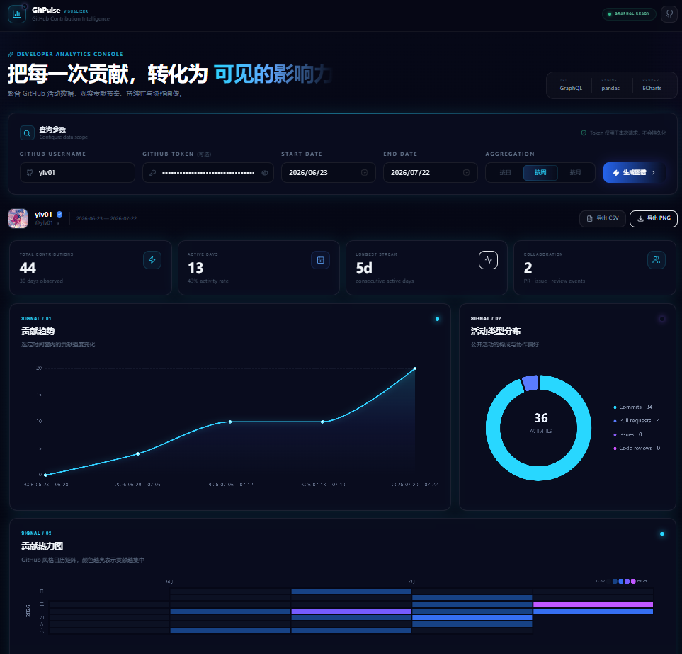

可根据 GitHub 账号与日期范围，按日、周、月展示 Push 数量，并支持将可视化结果保存为图片。

# GitPulse · GitHub Contribution Visualizer

一个可直接运行的 GitHub 贡献可视化 MVP。输入 GitHub 用户名与日期范围后，应用通过 GitHub GraphQL API 拉取贡献数据，使用 pandas 聚合，再通过 ECharts 生成趋势、日历热力图与活动类型分布图。

## 功能

- GitHub 用户名查询
- 页面 Token 可选输入，或使用后端环境变量中的 Token
- 自定义开始与结束日期，最多单次查询 10 年
- 按日 / 周 / 月聚合贡献趋势
- GitHub 风格日历热力图，支持跨年展示
- commits / pull requests / issues / code reviews 活动类型分布
- 总贡献、活跃天数、最长连续贡献等关键指标
- 一键导出完整可视化报告 PNG
- 一键导出日数据、聚合趋势和活动分布 CSV
- 对超过一年的范围自动分片请求 GitHub API 并合并数据
- 深色科技风、蓝紫霓虹、响应式 Dashboard

## 技术栈

- Frontend: Next.js、TypeScript、Tailwind CSS、ECharts
- Backend: FastAPI、pandas、httpx、GitHub GraphQL API
- Tests: pytest
- Deployment: Docker Compose（可选）

## 目录结构

```text
GitHub Contribution Visualizer/
├── .env.example
├── .gitignore
├── docker-compose.yml
├── start-dev.ps1
├── README.md
├── backend/
│   ├── .env.example
│   ├── Dockerfile
│   ├── requirements.txt
│   ├── app/
│   │   ├── main.py                 # FastAPI 入口与路由
│   │   ├── config.py               # 环境配置
│   │   ├── models.py               # Pydantic 请求/响应模型
│   │   ├── github_client.py        # GitHub GraphQL 客户端
│   │   └── services/
│   │       └── contributions.py    # 日期切片、pandas 聚合、指标计算
│   └── tests/
│       └── test_contributions.py
└── frontend/
    ├── .env.example
    ├── Dockerfile
    ├── package.json
    ├── tailwind.config.ts
    ├── app/
    │   ├── globals.css
    │   ├── layout.tsx
    │   └── page.tsx
    ├── components/
    │   ├── Dashboard.tsx
    │   ├── MetricCard.tsx
    │   └── charts/
    │       ├── ActivityChart.tsx
    │       ├── HeatmapChart.tsx
    │       └── TrendChart.tsx
    └── lib/
        ├── api.ts
        ├── export.ts
        └── types.ts
```

## 前置要求

- Node.js 20+
- Python 3.10+
- 一个 GitHub Personal Access Token

GitHub GraphQL API 必须经过身份认证，因此“Token 可选”指：

1. 可以在页面临时输入 Token；它只随本次请求发送，不写入文件或数据库。
2. 也可以把 Token 配置在后端 `backend/.env` 的 `GITHUB_TOKEN` 中，此时页面无需输入。

只查询公开贡献时建议使用最小权限 Token。若需要统计 Token 所属账户可见的私有贡献，请根据仓库类型配置相应读取权限；GitHub 仍不会返回私有贡献的仓库或活动明细。

## 本地启动

### 1. 启动后端

```powershell
cd "E:\GitHub Contribution Visualizer\backend"(取决于你的项目拉取盘符和位置修改)
python -m venv .venv
.\.venv\Scripts\Activate.ps1
pip install -r requirements.txt
Copy-Item .env.example .env
```

编辑 `backend/.env`：

```dotenv
GITHUB_TOKEN=github_pat_your_token_here
FRONTEND_ORIGINS=http://localhost:3000
GITHUB_GRAPHQL_URL=https://api.github.com/graphql
REQUEST_TIMEOUT_SECONDS=30
```

启动 API：

```powershell
uvicorn app.main:app --reload --port 8000
```

可访问：

- API health: http://localhost:8000/api/health
- Swagger: http://localhost:8000/docs

### 2. 启动前端

另开一个 PowerShell：

```powershell
cd "E:\GitHub Contribution Visualizer\frontend"(取决于你的项目拉取盘符和位置修改)
Copy-Item .env.example .env.local
npm install
npm run dev
```

浏览器打开 http://localhost:3000。

也可以在项目根目录运行 `./start-dev.ps1`，脚本会分别打开前后端开发进程。首次启动会自动安装依赖。

## Docker Compose 启动

在项目根目录创建 `.env`，可参考根目录 `.env.example`：

```dotenv
GITHUB_TOKEN=github_pat_your_token_here
```

然后执行：

```powershell
docker compose up --build
```

访问 http://localhost:3000。API 位于 http://localhost:8000。

## API

`POST /api/contributions`

请求示例：

```json
{
  "username": "torvalds",
  "start_date": "2025-01-01",
  "end_date": "2025-12-31",
  "aggregation": "week"
}
```

也可以在请求中增加 `"token": "github_pat_..."`。接口返回：

- `user`: GitHub 用户资料
- `daily`: 完整连续日期序列，用于热力图和 CSV
- `trend`: 按指定粒度聚合的数据
- `activity`: 四类公开活动统计
- `meta`: 总贡献、活跃天数、最长连续贡献、私有贡献数量等

## 测试与检查

后端：

```powershell
cd backend
pytest -q
```

前端：

```powershell
cd frontend
npm run typecheck
npm run build
```

## 数据与隐私说明

- 本项目不包含数据库，页面输入的 Token 不会被持久化。
- 生产部署必须启用 HTTPS，并限制 `FRONTEND_ORIGINS`。
- 日历总贡献可能包含 GitHub 不公开分类细节的贡献，因此它不一定等于四类活动数量之和。
- GitHub API 的限流、可见性设置和 Token 权限会影响结果。
